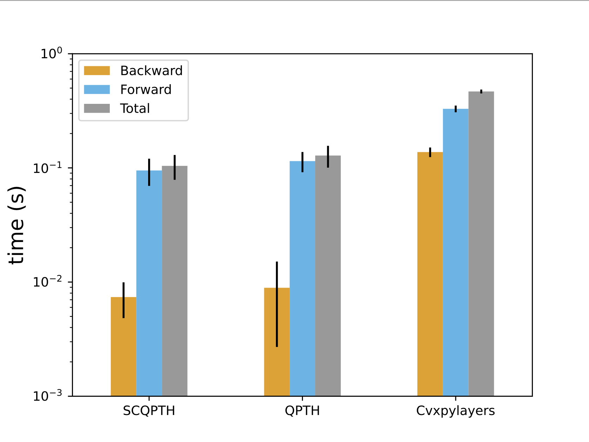
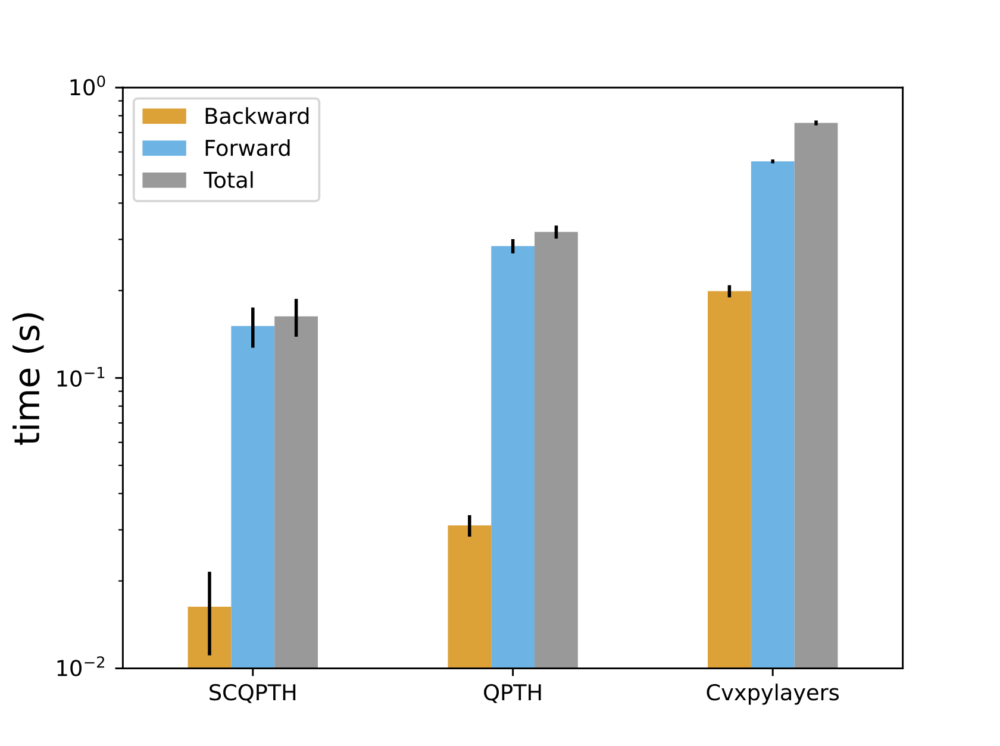
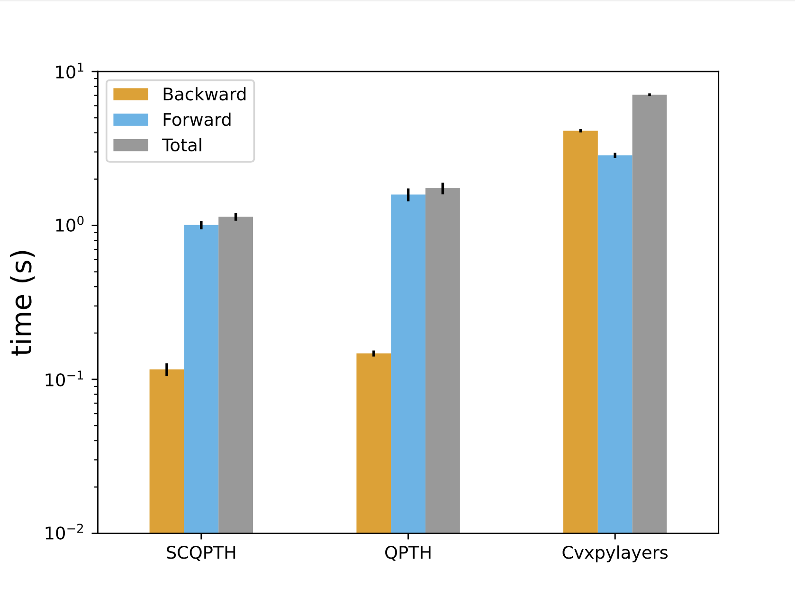
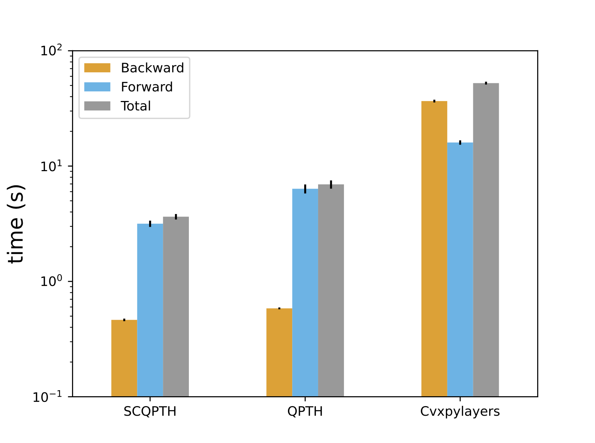
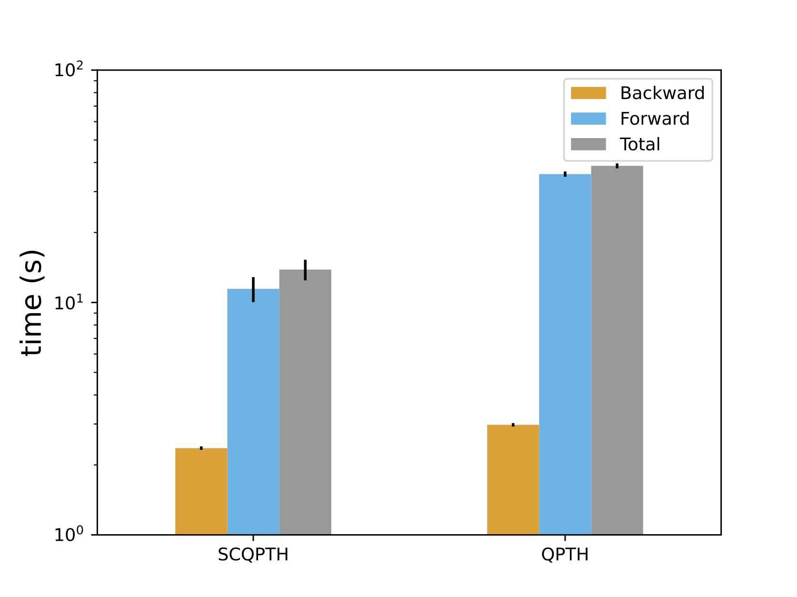
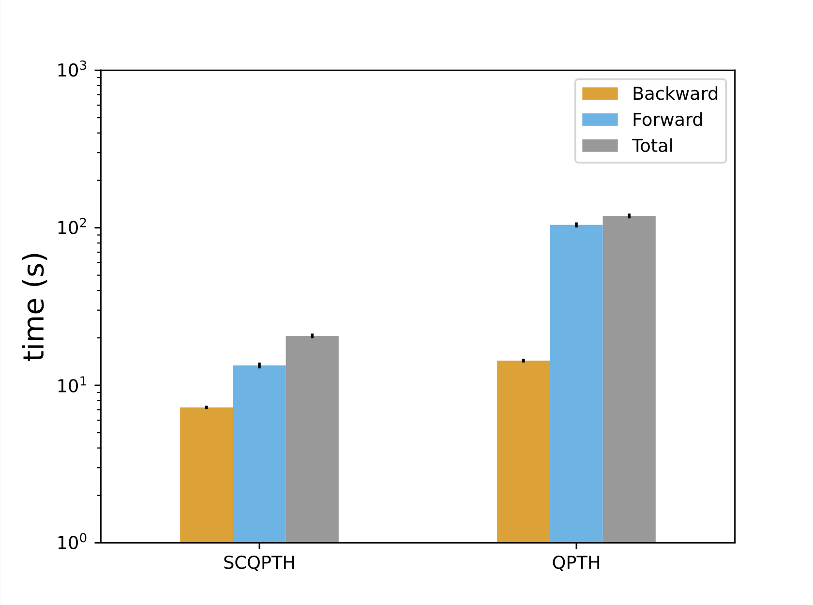
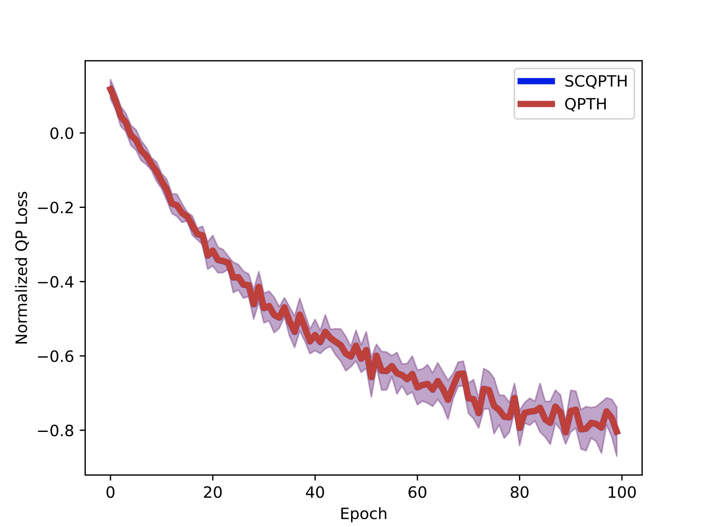

# scqpth_bench
This repository provides benchmark experiments for the SCQPTH differentiable QP solver. SCQPTH is a differentiable first-order splitting method for convex quadratic programs. The QP solver is implemented as a custom PyTorch module. The forward solver invokes a basic implementation of the ADMM algorithm. Backward differentiation is performed by implicit differentiation of a fixed-point mapping customized to the ADMM algorithm.

For more information please see our publication:

[arXiv (preprint)](https://github.com/ipo-lab/scqpth)

## Core Dependencies:
To use the ADMM solver you will need to install [numpy](https://numpy.org) and [Pytorch](https://pytorch.org). Please see requirements.txt for details and to run demos and replicate experiments.

## Runtime Experiments:
The [demo](demo) directory contains simple demos for forward solving and backward differentiating through the ADMM solver. The following runtime experiments are available in the [experiments](experiments) directory.

All experiments are conducted on an Apple Mac Pro computer (2.6 GHz 6-Core Intel Core i7,32 GB 2667 MHz DDR4) running macOS ‘Monterey’.

### Experiment 1:
Runtime: n = 10            |  Runtime: n = 50    
:-------------------------:|:-------------------------:
  |  

Runtime: n = 100            |  Runtime: n = 250    
:-------------------------:|:-------------------------:
  |  

Runtime: n = 500            |  Runtime: n = 1000    
:-------------------------:|:-------------------------:
  |  

Computational performance of SCQPTH, QPTH and Cvxpylayers for random QPs of
various problem sizes, n, constraints m = n, and low stopping tolerance (1e−3).

### Experiment 2:

Runtime: n = 100            |  Convergence: n = 100    
:-------------------------:|:-------------------------:
  |  

Training loss and computational performance for learning p. Problem setup: n = 100, m = 200, batch size = 32, epochs = 100, and stopping tolerance = 1e-3.
